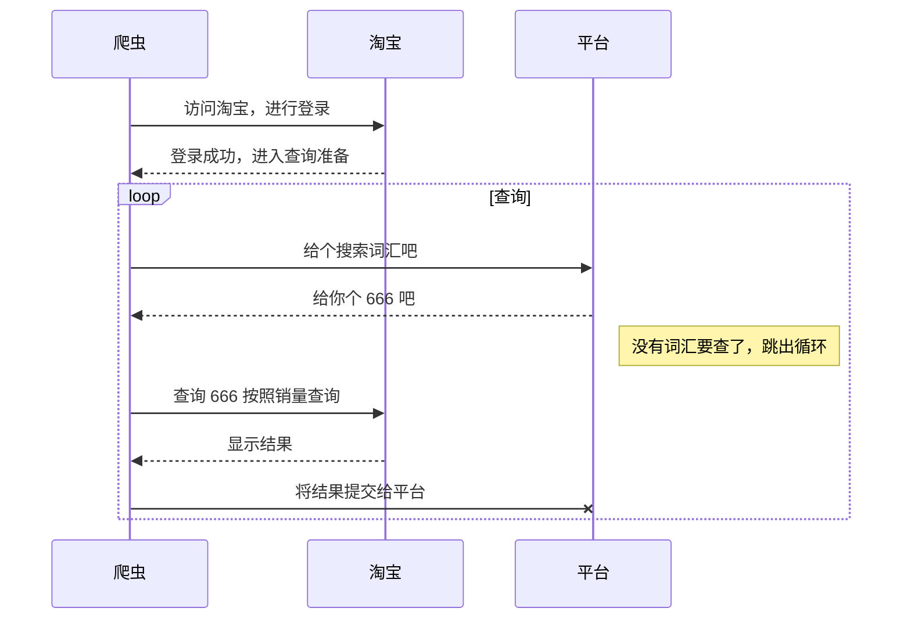

> 发现都是换取到token令牌后，然后去访问淘宝进行爬取的，感觉太麻烦了，换了一个比较傻瓜式的方法。
> 使用java+selenium+swing做的一个小桌面软件，用于爬取淘宝首页数据。

博客地址：[笑笑庄](https://blog.csdn.net/dubismile/article/details/106498538)

# 项目说明
## 界面说明
   

  1. 淘宝账号和淘宝密码是用来登陆账号使用的，可能中途需要输入手机验证码登录，建议第一次先输入验证码后；
  2. 浏览器、浏览器路径和驱动路径是以谷歌浏览器和火狐浏览器为主。**注意浏览器版本要和驱动对应**
    - chrome浏览器使用chromedriver。
     - firefox浏览器使用geckodriver
  3. 获取接口地址是用来获取查询搜索词汇。
  4. 提交信息地址是用来将查询到的商品数据上传到平台。

## 流程说明
